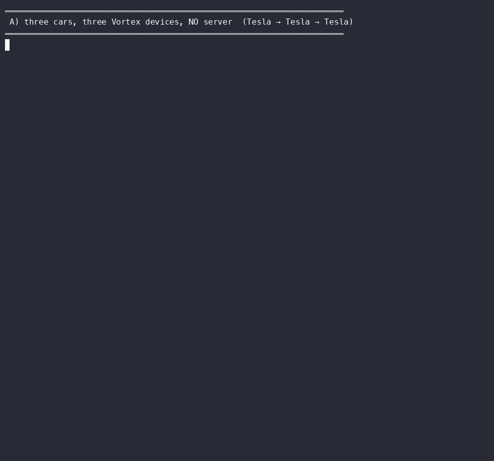

# Tesla → Tesla → Tesla

Three cars. Each one keeps its own copy of the fleet's ledger. No server.
One car drops off the network and comes back — and ends up with the same ledger,
byte for byte, body of every record included.

The records are real Tesla fleet-telemetry `Payload` messages
([teslamotors/fleet-telemetry](https://github.com/teslamotors/fleet-telemetry),
Apache-2.0), produced with their own `vehicle_data.proto`. Part B replays the
same records through Tesla's reference server — their code, their mTLS
WebSocket, their envelope — so the two architectures sit side by side.



```
device  records  digest(seq, hash, body)
  0        100   c27920cdb8c42e7a
  1        100   c27920cdb8c42e7a
  2        100   c27920cdb8c42e7a      ← the car that left and came back
SAME LEDGER, BODY INCLUDED, ON ALL DEVICES: YES

first records, in ledger order, decoded back as Tesla Payloads:
  seq 0  vin …001  speed 61.6  soc 79.98  loc (37.4035, -122.2347)
  seq 1  vin …002  speed 57.3  soc 79.98  loc (37.4857, -122.2447)
  seq 2  vin …003  speed 59.2  soc 79.98  loc (37.4139, -122.2044)
```

Today (part B) the car talks only to the server — Tesla's README: *"vehicles
communicate only with the server"* — so the server is the one holder of the
whole picture. Here (part A) all three cars hold it.

## See it run

**On GitHub, live:** open [Actions → *run the demo*](../../actions). Every run is
public: the output is on the run's summary page and the three ledgers are
downloadable artifacts. It runs every Monday and on every push, so there is
always a recent one. Full text of one run: [`results/demo_output.txt`](results/demo_output.txt).

**Why you cannot just press "Run workflow" on a fork:** the Vortex node is not
in this repository. The job fetches it during the run from the project's own
server with a read-only deploy key held in this repository's secrets. Forks do
not receive secrets. This is deliberate: the node is the thing being evaluated,
not distributed.

## Pick the order yourself

The claim underneath this demo is that the ledger is a function of the *set* of
records, not of the order they arrived in. You can test that without trusting
anyone: [**Pick the order**](https://vasilisnasopoulos.github.io/pick-the-order.html)
takes any integer you choose as a shuffle seed, replays 3,000 transactions to
5 nodes in that order, and posts the resulting hash. Every seed so far has
produced the same one.

## Getting the node, to run it yourself

Ask. Evaluation copies (Linux x86_64 static, macOS arm64) are given on request
to people and teams who want to run the demo on their own machines or extend
it. Then:

```bash
./setup.sh                                   # Tesla's proto → Python, clones their repo
VORTEX_BIN=/path/to/vortex_dse_full3 ./run_demo.sh   # ~2 minutes
```

Needs `python3` and `git`; `go` (and `libzmq`) only for part B.

## What is in here

| | |
|---|---|
| `demo/car.py` | a "car": generates Tesla `Payload` records, hands each to its own Vortex device (`POST /tx` on localhost) |
| `demo/read_ledger.py` | reads each device's ledger back as Tesla records and compares the devices |
| `demo/vehicle_client.go` | a vehicle the way Tesla's server expects one (built inside their module, uses their envelope code) |
| `demo/server_config.json` | Tesla's server with the logger dispatcher |
| `.github/workflows/demo.yml` | the Actions run |
| `results/` | one recorded run: GIF and text |

## What the demo does and does not show

- It shows three peers reaching one ledger with no coordinator, and a peer that
  was away catching up from the others. It shows the record bodies inside the
  ledger, decodable with Tesla's schema.
- The 20 records car 3 produced **while its own device was off** are not in
  any ledger: a car whose node is down does not write. In a real vehicle the
  node and the vehicle are one.
- It is loopback. The same node runs on three continents in our testnet; this
  demo is the shape, not the scale.
- Tesla's server is measured as "received", not benchmarked — that was not the
  question.

## License

Everything in this repository is MIT. The Vortex node is not in this
repository; evaluation copies come with their own terms.
Tesla's `fleet-telemetry` is Apache-2.0 and is cloned by `setup.sh`, not vendored.
